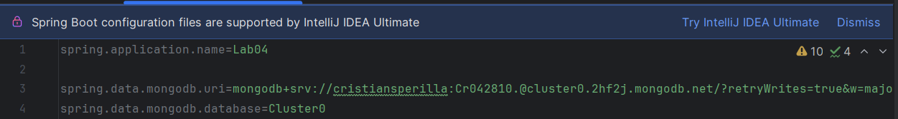
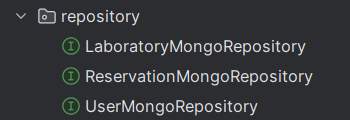
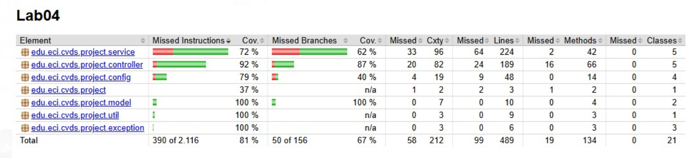

# **Laboratorio 4 - Scrum - DI/IOC**

## **Tabla de Contenidos**
- [Prerrequisitos](#prerrequisitos)
- [Objetivos](#objetivos)
- [Caso de Negocio](#caso-de-negocio)
- [Requerimientos](#requerimientos)
- [Épicas](#épicas)
- [Sprints](#sprints)
- [Modelo de Arquitectura](#modelo-de-arquitectura)
- [Análisis de Calidad del Código](#análisis-de-calidad-del-código)

---

## **Prerrequisitos**
Antes de comenzar, se debe tener instalado lo siguiente:
- **Java OpenJDK 17**
- **Apache Maven 3.9.x**
- **Spring Boot**
- **Docker**
- **Azure DevOps**
- **SonarQube**
- **JaCoCo**

---

## **Objetivos**
- Planificación de un proyecto de software con metodologías ágiles.
- Entender la arquitectura **Cliente-Servidor**.
- Aplicar **Inyección de Dependencias (DI) e Inversión de Control (IoC)** en Spring Boot.
- Implementar una base de datos **NoSQL (MongoDB Cloud)**.
- Definir un **API REST** con **Spring Boot**.
- Realizar análisis estático del código para mejorar su calidad.
- Integrar **pruebas unitarias** en el desarrollo.

---

## **Caso de Negocio**
 **Sistema de Reservas de Laboratorios para la Decanatura de Ingeniería de Sistemas**

El proyecto consiste en una aplicación web para gestionar la reserva de laboratorios en la Escuela Colombiana de Ingeniería Julio Garavito.  
Los usuarios podrán:  
- **Consultar** la disponibilidad de laboratorios.  
- **Reservar** un laboratorio con fecha, hora y propósito.  
- **Cancelar** sus reservas.

 **Tecnologías utilizadas:**
- **Frontend:** Interfaz web en **HTML, CSS, JavaScript**.
- **Backend:** API REST con **Spring Boot**.
- **Base de Datos:** **MongoDB Cloud** o almacenamiento en **archivo plano**.

---

## **Requerimientos**
- El usuario debe poder consultar la disponibilidad de laboratorios.
- El usuario debe poder reservar un laboratorio seleccionando fecha, hora y propósito.
- El usuario debe poder cancelar sus reservas.
- La aplicación debe validar que un laboratorio **no se pueda reservar si ya está ocupado**.

---

## **Épicas**
1. **Frontend**: Crear una interfaz gráfica que permita gestionar reservas.
2. **Backend**: Implementar un API REST para la lógica de negocio y persistencia de datos.

---

## **Sprints**
### **Sprint 1: Configuración General del Proyecto**
- Configurar el ambiente de desarrollo (Backend y Frontend):
Usando Spring Initializr, creamos el proyecto con las configuraciones mínimas

- Crear la estructura base del proyecto (**scaffolding**).
- Configurar la base de datos en **MongoDB Cloud** o archivo plano:
Se crea un cluster en MongoDB para poder generar persistencia, agregamos el enlace a ese cluster más su nombre en el .properties




### **Sprint 2: Implementación del API REST**
- Crear los **endpoints** para consultas, reservas y cancelaciones.
Se crearon los siguientes endpoints:

### Gestión de laboratorios

```java
@GetMapping("/all")
public List<Laboratory> getAllLaboratories() {
    return laboratoryService.getAllLaboratories();
}

/**
 * Obtiene un laboratorio por su ID.
 * @param id Identificador del laboratorio.
 * @return ResponseEntity con el laboratorio encontrado o un estado 404 si no existe.
 */
@GetMapping("id/{id}")
public ResponseEntity<Laboratory> getLaboratoryById(@PathVariable String id) {
    Optional<Laboratory> laboratory = laboratoryService.getLaboratoryById(id);
    if (laboratory.isPresent()) {
        return ResponseEntity.ok(laboratory.get());
    } else {
        return ResponseEntity.notFound().build();
    }
}

@GetMapping("name/{name}")
public ResponseEntity<Laboratory> getLaboratoryByName(@PathVariable String name) {
    Laboratory laboratory = laboratoryService.getLaboratoryByName(name);
    if (laboratory != null) {
        return ResponseEntity.ok(laboratory);
    } else {
        return ResponseEntity.notFound().build();
    }
}

/**
 * Crea un nuevo laboratorio.
 * @param laboratoryDTO Objeto Laboratory recibido en la solicitud.
 * @return ResponseEntity con el laboratorio creado.
 */
@PostMapping("/create")
public ResponseEntity<Laboratory> createLaboratory(@RequestBody LaboratoryDTO laboratoryDTO, 
                                                   @RequestHeader("Authorization") String token) {
    Laboratory created = laboratoryService.saveLaboratory(laboratoryDTO, token);
    return ResponseEntity.ok(created);
}

/**
 * Verifica la disponibilidad de un laboratorio en una fecha y hora específica.
 * @param id Identificador del laboratorio.
 * @param dateTimeString Fecha y hora en formato de cadena.
 * @return ResponseEntity con un mensaje indicando si está disponible o no.
 */
@GetMapping("avaiable/{id}")
public ResponseEntity<String> checkLaboratoryAvailability(@PathVariable String id, 
                                                          @RequestParam("dateTime") String dateTimeString) {
    LocalDateTime dateTime = LocalDateTime.parse(dateTimeString);
    Optional<Laboratory> laboratoryOpt = laboratoryService.getLaboratoryById(id);

    if (laboratoryOpt.isEmpty()) {
        return new ResponseEntity<>("Laboratory not found", HttpStatus.NOT_FOUND);
    }

    Laboratory laboratory = laboratoryOpt.get();
    boolean available = laboratoryService.isLaboratoryAvailable(laboratory, dateTime);

    if (available) {
        return new ResponseEntity<>("Laboratory is available", HttpStatus.OK);
    } else {
        return new ResponseEntity<>("Laboratory is not available", HttpStatus.CONFLICT);
    }
}

/**
 * Verifica la disponibilidad de laboratorios en un rango de fecha y hora.
 * @return ResponseEntity con la lista de laboratorios disponibles en ese rango.
 */
@GetMapping("avaiable")
public ResponseEntity<List<String>> checkLaboratoriesAvailability(@RequestParam("startDateTime") String dateTimeStartString,
                                                                  @RequestParam("endDateTime") String dateTimeEndString) {
    LocalDateTime dateStartTime = LocalDateTime.parse(dateTimeStartString);
    LocalDateTime dateEndTime = LocalDateTime.parse(dateTimeEndString);
    List<Laboratory> laboratories = laboratoryService.getAllLaboratories();
    List<String> oklaboratories = new ArrayList<>();

    if (laboratories.isEmpty()) {
        return new ResponseEntity<>(HttpStatus.NOT_FOUND);
    }

    for (Laboratory laboratory : laboratories) {
        boolean available = laboratoryService.isLaboratoriesAvailable(laboratory, dateStartTime, dateEndTime);

        if (available) {
            oklaboratories.add(laboratory.getName());
        }
    }

    if (oklaboratories.isEmpty()) {
        return new ResponseEntity<>(HttpStatus.NOT_FOUND);
    }

    return new ResponseEntity<>(oklaboratories, HttpStatus.OK);
}
```

### Para gestionar el Login

```java
@PostMapping("/login")
public ResponseEntity<String> login(@RequestBody Map<String, String> credentials) {
    String username = credentials.get("username");
    String password = credentials.get("password");
    try {
        // Generación del token
        String token = loginService.loginUser(username, password);
        return ResponseEntity.ok(token); // Devuelve el token al cliente

    } catch (UserException.UserNotFoundException e) {
        return ResponseEntity.status(HttpStatus.NOT_FOUND).body("User not found");
    } catch (UserException.UserIncorrectPasswordException e) {
        return ResponseEntity.status(HttpStatus.UNAUTHORIZED).body("Incorrect password");
    } catch (Exception e) {
        return ResponseEntity.status(HttpStatus.INTERNAL_SERVER_ERROR).body("Unknown server error");
    }
}
```

### Gestión de reservaciones

```java
/**
 * Crea una nueva reserva.
 * @param reservationDTO Objeto Reservation recibido en la solicitud.
 * @return La reserva creada.
 */
@PostMapping("/create")
public ResponseEntity<?> createReservation(@RequestBody ReservationDTO reservationDTO) {
    try {
        Reservation reservation = reservationService.createReservation(reservationDTO);
        return ResponseEntity.ok(reservation);
    } catch (Exception e) {
        return ResponseEntity.badRequest().body("Error: " + e.getMessage());
    }
}

/**
 * This method is in charge of updating a task in the application
 * calling the service.
 * @param reservation
 * @return the updated task.
 */
@PatchMapping("/update")
public ResponseEntity<?> updateReservation(@RequestBody Reservation reservation) {
    HashMap<String, Object> response = new HashMap<>();
    try {
        return ResponseEntity.status(HttpStatus.ACCEPTED).body(reservationService.updateReservation(reservation));
    } catch (Exception e) {
        response.put("error", e.getMessage());
        return ResponseEntity.status(HttpStatus.BAD_REQUEST).body(response);
    }
}

/**
 * Cancela una reserva existente.
 * @param id Identificador de la reserva a cancelar.
 * @return ResponseEntity con estado 204 si se cancela correctamente o 404 si no se encuentra.
 */
@DeleteMapping("cancel/{id}")
public ResponseEntity<Void> cancelReservation(@PathVariable String id) {
    boolean cancelled = reservationService.cancelReservation(id);
    if (cancelled) {
        return ResponseEntity.noContent().build();
    }
    return ResponseEntity.notFound().build();
}

/**
 * Obtiene la lista de todas las reservas.
 * @return Lista de reservas.
 */
@GetMapping("/all")
public List<Reservation> getAllReservations() {
    return reservationService.getAllReservations();
}

/**
 * Genera reservas aleatorias dentro de un rango dado.
 *
 * @param min Cantidad mínima de reservas a generar (valor por defecto: 100).
 * @param max Cantidad máxima de reservas a generar (valor por defecto: 1000).
 * @return Mensaje de confirmación de la generación de reservas.
 */
@PostMapping("/generate")
public ResponseEntity<String> generateReservations(@RequestParam(defaultValue = "100") int min, 
                                                   @RequestParam(defaultValue = "1000") int max) {
    reservationService.generateRandomReservations(min, max);
    return ResponseEntity.ok("Reservas generadas exitosamente.");
}

/**
 * Obtiene la cantidad de reservas agrupadas por fecha.
 *
 * @return Un mapa donde la clave es la fecha y el valor es el número de reservas en esa fecha.
 */
@GetMapping("/by-date")
public ResponseEntity<Map<LocalDate, Long>> getReservationsByDate() {
    List<Reservation> reservations = getAllReservations();
    Map<LocalDate, Long> reservationsByDate = new HashMap<>();

    for (Reservation r : reservations) {
        LocalDate date = r.getStartDateTime().toLocalDate();
        reservationsByDate.put(date, reservationsByDate.getOrDefault(date, 0L) + 1);
    }

    return ResponseEntity.ok(reservationsByDate);
}

/**
 * Obtiene la cantidad de reservas agrupadas por laboratorio en un rango de fechas.
 *
 * @param startDate Fecha de inicio del rango.
 * @param endDate   Fecha de fin del rango.
 * @return Un mapa donde la clave es el nombre del laboratorio y el valor es el número de reservas dentro del rango.
 */
@GetMapping("/by-lab-and-date")
public ResponseEntity<Map<String, Long>> getReservationsByLabAndDate(
        @RequestParam LocalDate startDate,
        @RequestParam LocalDate endDate) {

    List<Reservation> reservations = getAllReservations();
    Map<String, Long> reservationsByLab = new HashMap<>();

    for (Reservation r : reservations) {
        LocalDate date = r.getStartDateTime().toLocalDate();
        if (!date.isBefore(startDate) && !date.isAfter(endDate)) {
            String labName = r.getLaboratoryname();
            reservationsByLab.put(labName, reservationsByLab.getOrDefault(labName, 0L) + 1);
        }
    }

    return ResponseEntity.ok(reservationsByLab);
}

/**
 * Calcula el promedio de reservas por prioridad.
 *
 * @return Un mapa donde la clave es el nivel de prioridad y el valor es el promedio de reservas con esa prioridad.
 */
@GetMapping("/average-by-priority")
public ResponseEntity<Map<Integer, Double>> getAverageReservationsByPriority() {
    List<Reservation> reservations = getAllReservations();
    Map<Integer, Long> countByPriority = new HashMap<>();

    for (Reservation r : reservations) {
        int priority = r.getPriority();
        countByPriority.put(priority, countByPriority.getOrDefault(priority, 0L) + 1);
    }

    int totalReservations = reservations.size();
    Map<Integer, Double> averageByPriority = new HashMap<>();

    for (Map.Entry<Integer, Long> entry : countByPriority.entrySet()) {
        int priority = entry.getKey();
        double average = (double) entry.getValue() / totalReservations;
        averageByPriority.put(priority, average);
    }

    return ResponseEntity.ok(averageByPriority);
}

/**
 * Obtiene la cantidad de reservas agrupadas por laboratorio.
 *
 * @return Un mapa donde la clave es el nombre del laboratorio y el valor es el número de reservas en ese laboratorio.
 */
@GetMapping("/by-lab")
public ResponseEntity<Map<String, Long>> getReservationsByLab() {
    List<Reservation> reservations = getAllReservations();
    Map<String, Long> reservationsByLab = new HashMap<>();

    for (Reservation r : reservations) {
        String labName = r.getLaboratoryname();
        reservationsByLab.put(labName, reservationsByLab.getOrDefault(labName, 0L) + 1);
    }

    return ResponseEntity.ok(reservationsByLab);
}

/**
 * Elimina todas las reservas del sistema.
 * @return ResponseEntity con un mensaje de éxito.
 */
@DeleteMapping("/delete-all")
public ResponseEntity<String> deleteAllReservations() {
    reservationService.deleteAllReservations();
    return ResponseEntity.ok("Todas las reservas han sido eliminadas exitosamente.");
}
```

### Gestión de usuarios

```java
/**
* Obtiene la lista de todos los usuarios.
*
* @return Lista de usuarios.
*/
@GetMapping("/all")
@Secured("ROLE_ADMIN")
public List<User> getAllUsers() {
return userService.getAllUser();
}

    /**
     * Crea un nuevo usuario con rol de usuario estándar.
     *
     * @param userDTO Objeto UserDTO recibido en la solicitud.
     * @return ResponseEntity con el usuario creado o un error en caso de fallo.
     */
    @PostMapping("/create")
    public ResponseEntity<?> saveUser(@RequestBody UserDTO userDTO) {
        HashMap<String, String> response;
        try {
            userDTO.setRole(Role.USER);
            return ResponseEntity.status(HttpStatus.CREATED).body(userService.save(userDTO));
        } catch (Exception e) {
            response = new HashMap<>();
            response.put("error", e.getMessage());
            return ResponseEntity.badRequest().body(response);
        }
    }

    /**
     * Crea un nuevo usuario con rol de administrador.
     * @param username recibido en la solicitud.
     * @return ResponseEntity con el usuario creado o un error en caso de fallo.
     */
    @PostMapping("admin/create/{username}")
    public ResponseEntity<?> saveAdmin(@PathVariable String username,@RequestHeader("Authorization") String token ) {
        //verfificar que el usuario sea admin,html filter
        HashMap<String, String> response;
        try {
            return ResponseEntity.status(HttpStatus.CREATED).body(userService.updateAdmin(username,token));
        } catch (Exception e) {
            response = new HashMap<>();
            response.put("error", e.getMessage());
            return ResponseEntity.badRequest().body(response);
        }
    }

    /**
     * Obtiene un usuario por su ID.
     * @param id Identificador del usuario.
     * @return ResponseEntity con el usuario encontrado o un error si no se encuentra.
     */
    @GetMapping("/{id}")
    @Secured({"ROLE_ADMIN", "ROLE_USER", "ROLE_TEACHER"})
    public ResponseEntity<?> getUserById(@PathVariable String id) {
        HashMap<String, String> response;
        try {
            return ResponseEntity.status(HttpStatus.OK).body(userService.getUserById(id));
        } catch (Exception e) {
            response = new HashMap<>();
            response.put("error", e.getMessage());
            return ResponseEntity.badRequest().body(response);
        }
    }

    @GetMapping("/username/{username}")
    @Secured({"ROLE_ADMIN", "ROLE_USER", "ROLE_TEACHER"})
    public ResponseEntity<?> getUserByUsername(@PathVariable String username) {
        HashMap<String, String> response;
        try {
            return ResponseEntity.status(HttpStatus.OK).body(userService.getUserByUsername(username));
        } catch (Exception e) {
            e.printStackTrace(); // Imprime la traza de la excepción en la consola
            response = new HashMap<>();
            response.put("error", e.getMessage());
            return ResponseEntity.badRequest().body(response);
        }
    }

    /**
     * Elimina un usuario por su ID.
     * @param id Identificador del usuario a eliminar.
     * @return ResponseEntity con confirmación de eliminación o un error en caso de fallo.
     */
    @DeleteMapping("/{id}")
    public ResponseEntity<?> deleteUser(@PathVariable String id) {
        HashMap<String, String> response;
        try {
            userService.deleteUser(id);
            response = new HashMap<>();
            response.put("user-delete", id);
            return ResponseEntity.status(HttpStatus.OK).body(response);
        } catch (Exception e) {
            response = new HashMap<>();
            response.put("error", e.getMessage());
            return ResponseEntity.badRequest().body(response);
        }
    }

    /**
     * Obtiene todas las reservas asociadas a un usuario por su ID.
     * @param id Identificador del usuario.
     * @return ResponseEntity con la lista de reservas o un error en caso de fallo.
     */
    @GetMapping("/getReservations/{id}")
    @Secured({"ROLE_ADMIN", "ROLE_USER", "ROLE_TEACHER"})
    public ResponseEntity<?> getAllReservationByUserId(@PathVariable String id) {
        HashMap<String, String> response;
        try {
            return ResponseEntity.status(HttpStatus.OK).body(userService.getAllReservationByUserId(id));
        } catch (Exception e) {
            response = new HashMap<>();
            response.put("error", e.getMessage());
            return ResponseEntity.badRequest().body(response);
        }
    }
    @GetMapping("/getReservationsByUsername/{username}")
    @Secured({"ROLE_ADMIN", "ROLE_USER", "ROLE_TEACHER"})
    public ResponseEntity<?> getAllReservationByUsername(@PathVariable String username) {
        HashMap<String, String> response;
        try {
            userService.verifyReservations(username);
            return ResponseEntity.status(HttpStatus.OK).body(userService.getAllReservationByUsername(username));
        } catch (Exception e) {
            response = new HashMap<>();
            response.put("error", e.getMessage());
            return ResponseEntity.badRequest().body(response);
        }
    }

    @PatchMapping("/update")
    @Secured({"ROLE_ADMIN", "ROLE_USER", "ROLE_TEACHER"})
    public ResponseEntity<?> updateReservation(@RequestBody User user) {
        HashMap<String, Object> response = new HashMap<>();
        try {
            return ResponseEntity.status(HttpStatus.ACCEPTED).body(userService.updateUser(user));
        } catch (Exception e) {
            response.put("error", e.getMessage());
            return ResponseEntity.status(HttpStatus.BAD_REQUEST).body(response);
        }
    }
    @GetMapping("/role/{username}")
    public ResponseEntity<String> getUserRole(@PathVariable String username) {
        try {
            String role = userService.getRoleByUsername(username);
            return ResponseEntity.ok(role);
        } catch (Exception e) {
            return ResponseEntity.status(HttpStatus.NOT_FOUND).body("User not found");
        }
    }
```

- Implementar validaciones para evitar reservas en laboratorios ocupados.
Usamos el metodo isLaboratoryAvilable para determinar si un laboratorio está disponible o no para la fecha indicada
```java
/**
     * Verifica si un laboratorio está disponible dentro de un rango de fechas.
     * @param laboratory Laboratorio a verificar.
     * @param start Fecha y hora de inicio.
     * @param end Fecha y hora de fin.
     * @return true si el laboratorio está disponible, false si está ocupado.
     */
    @Override
    public boolean isLaboratoryAvilable(Laboratory laboratory, LocalDateTime start, LocalDateTime end) {
        List<Reservation> reservations = reservationRepository.findByLaboratoryname(laboratory.getName());

        for (Reservation reservation : reservations) {
            LocalDateTime existingStart = reservation.getStartDateTime();
            LocalDateTime existingEnd = reservation.getEndDateTime();
            if (start.isBefore(existingEnd) && end.isAfter(existingStart)) {
                return false;
            }
        }
        return true;
    }
```

- Configurar la persistencia de datos.
Utilizamos interfaces que heredan de MongoRepository
  

### **Sprint 3: Conexión del Frontend con el API y Pruebas**
- Diseñar la interfaz gráfica para visualizar la disponibilidad de laboratorios.
- Conectar el **frontend** con el **API REST**.
- Realizar **pruebas de integración** y validación de funcionalidades.

---

## **Modelo de Arquitectura**
 *Diagrama de arquitectura del sistema*
 [Diagrama de clases](lab04_Astah.asta)

---

## **Análisis de Calidad del Código**
- **Cobertura de código** con **JaCoCo**.
  

---

## **Conclusión**
Este laboratorio permitió aplicar conceptos de **Scrum, Inyección de Dependencias (DI), Arquitectura Cliente-Servidor y CI/CD**, asegurando una **alta calidad de código** y una **entrega continua** del producto.

 **Autores:**
* **Laura Natalia Perilla Quintero** - [Lanapequin](https://github.com/Lanapequin)
* **Juan Miguel Rojas Chaparro** - [juanmiguelrojas](https://github.com/juanmiguelrojas)
* **Cristian David Silva Perilla** - [CRISTIANSILVAP](https://github.com/CRISTIANSILVAP)
* **Santiago Amaya Zapata** - [SantiagoAmaya21](https://github.com/SantiagoAmaya21)

---

